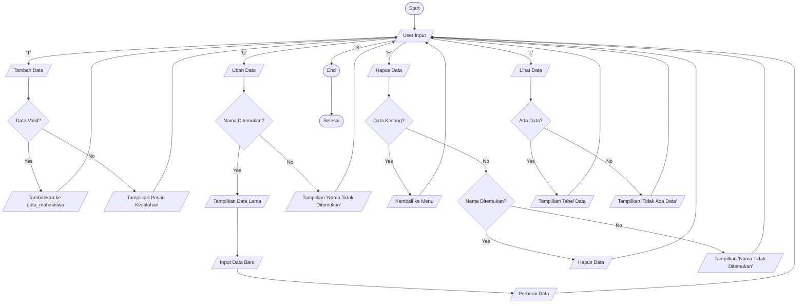

# Labpy 6

## Deskripsi Program
Aplikasi Python untuk manajemen data mahasiswa yang memungkinkan pengguna melakukan operasi CRUD (Create, Read, Update, Delete) pada data mahasiswa.

## Struktur Program

### Komponen Utama
- `data_mahasiswa`: Dictionary untuk menyimpan data mahasiswa
- Fungsi utama:
  - `lihat_data()`: Menampilkan data mahasiswa
  - `tambah_data()`: Menambah data mahasiswa baru
  - `ubah_data()`: Mengubah data mahasiswa
  - `hapus_data()`: Menghapus data mahasiswa

### Alur Kerja Program
1. Pengguna memilih menu (Tambah/Ubah/Hapus/Lihat/Keluar)
2. Program mengeksekusi fungsi sesuai pilihan
3. Data disimpan dalam dictionary `data_mahasiswa`

## Perhitungan Nilai
- Nilai Akhir = (Tugas * 0.3) + (UTS * 0.35) + (UAS * 0.35)
- Bobot:
  - Tugas: 30%
  - UTS: 35%
  - UAS: 35%

## Fitur Khusus
- Validasi input mencegah duplikasi NIM
- Fleksibilitas update data
- Tampilan data dalam format tabel
- Perhitungan otomatis nilai akhir

## Cara Penggunaan
- Jalankan script
- Pilih opsi menu:
  - `T`: Tambah data
  - `U`: Ubah data
  - `H`: Hapus data
  - `L`: Lihat data
  - `K`: Keluar program

## Flowchart 

## Contoh Output Program
